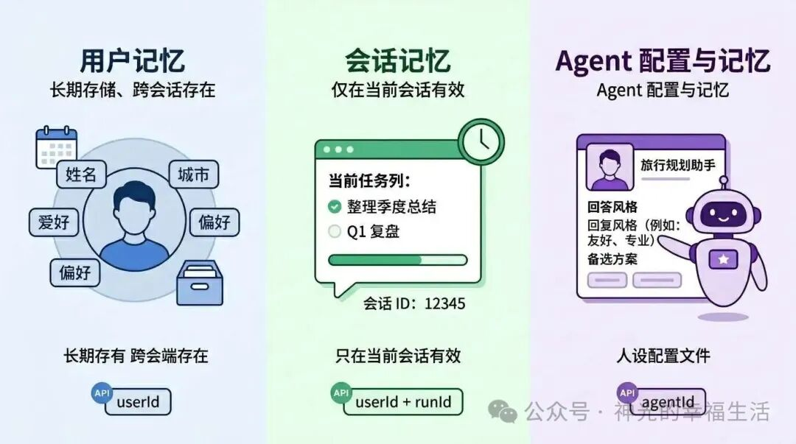

# Mem0

业界主流的 Agent 长期记忆库，原生集成向量语义检索、BM25 关键词检索、知识图谱关联检索三大能力，默认完成三路检索的融合打分与结果排序，完全契合我们的技术需求。

引入 Mem0 后，无需从零实现记忆检索能力，能够大幅缩短项目落地周期，降低开发成本，快速上线具备完整三路召回能力的长期记忆体系。

## 记忆范围

### 用户记忆（User Memory）

绑定 userId，存的是跟着人走的长期信息：姓名、城市、偏好、习惯等。

换会话、换 Agent 也能读到，适合个性化和跨场景复用。

### 会话记忆（Session Memory）

绑定 userId + runId，存的是当前这次对话里的任务上下文：这次要做什么、讨论到哪一步、临时目标等。

会话结束后可以清理，不会和别的 thread 混在一起。

### Agent 记忆（Agent Memory）

绑定 agentId，存的是某个 Agent 自己的设定：角色、语气、回答方式、专业领域等。

同一个用户换不同 Agent，各自保持独立人格和风格。

用户记忆管“这个人”，会话记忆管“这次聊什么”，Agent 记忆管“这个助手是谁”。