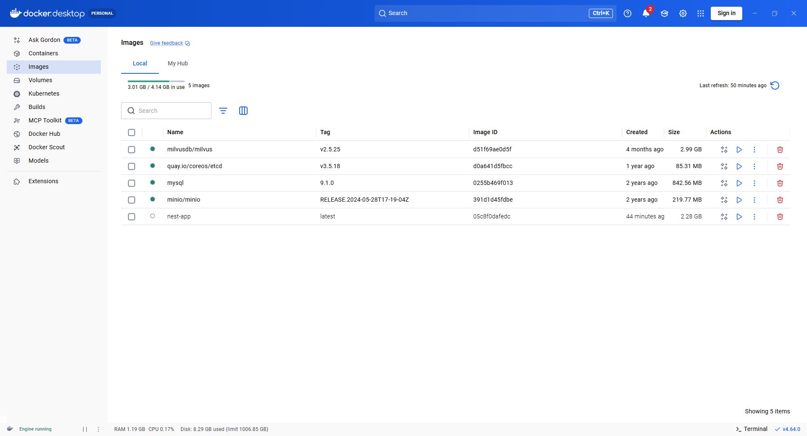
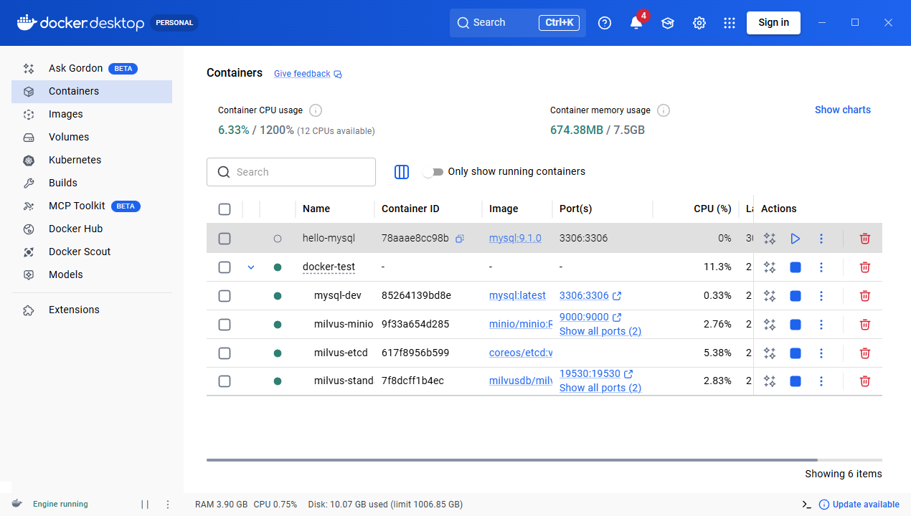

# [Docker](https://github.com/Lil-El/docker)

Docker 将应用及其依赖环境统一封装为镜像，镜像运行后就成为容器。

一台服务器可以同时运行多个容器，容器之间相互隔离，拥有独立的文件系统、网络、端口等环境，互不干扰，专门用来运行各类服务。

这样整个环境都保存在这个镜像里，部署多个实例只要通过这个镜像跑多个容器就行。

Docker 提供了 Docker Hub 镜像仓库，可以把本地镜像 push 到仓库或者从仓库 pull 镜像到本地。

port 是映射宿主机的端口到容器内的端口。

volume 数据卷是挂载本地某个目录到容器内的。

虽然在容器内跑数据库，但我们希望数据能持久化保存到宿主机，这样下次跑其他容器，也能用这个目录下的数据。

这就是数据卷 volume 的作用，把它挂载到容器就好了。

## 打包镜像

### 直接打包

创建 Dockerfile 文件

```bash
# 指定基础镜像
FROM node:22.17.0

# 指定工作目录
WORKDIR /app

COPY package*.json ./

RUN npm install

COPY . .

RUN npm run build

EXPOSE 3000

CMD ["node", "dist/main.js"]
```

执行命令打包镜像

```bash
docker build -t <image_name> .
```



这样是可以的，但是镜像里会多了一些无关代码

比如源码、非生产环境的依赖等

会导致镜像体积较大

### 多阶段构建

```bash
# 构建阶段：需要 devDependencies（含 @nestjs/cli、typescript）才能 nest build，但是生产阶段不需要 devDependencies ，所以分为两个阶段构建，第一阶段安装 devDependencies 并构建，第二阶段只安装生产依赖并运行。这样可以减小最终镜像的体积。
# 指定基础镜像
FROM node:22.17.0 AS builder

# 指定工作目录
WORKDIR /app

COPY package*.json ./

RUN npm install

COPY . .

RUN npm run build


# 运行阶段
FROM node:22.17.0

ENV NODE_ENV=production

WORKDIR /app

COPY package*.json ./

RUN npm install --production

COPY --from=builder /app/dist ./dist

EXPOSE 3000

CMD ["node", "dist/main.js"]
```

第一个阶段镜像只用于构建

之后再创建一个镜像，把前一个镜像构建出来的代码复制过去，跑起来

这样只保留最后一个镜像的文件，显然体积会更小

> 总结为一句话：用最轻量的运行时镜像，承载编译后的产物，把“构建环境”全部丢掉

## Docker Compose

Docker Compose 用于编排多个容器，统一管理启动参数、依赖顺序与网络环境。

所有容器默认处于同一内网，天然互通，可直接用容器名互相调用。

创建 `docker-compose.dev.yml`

运行命令 `pnpm run docker:up`

